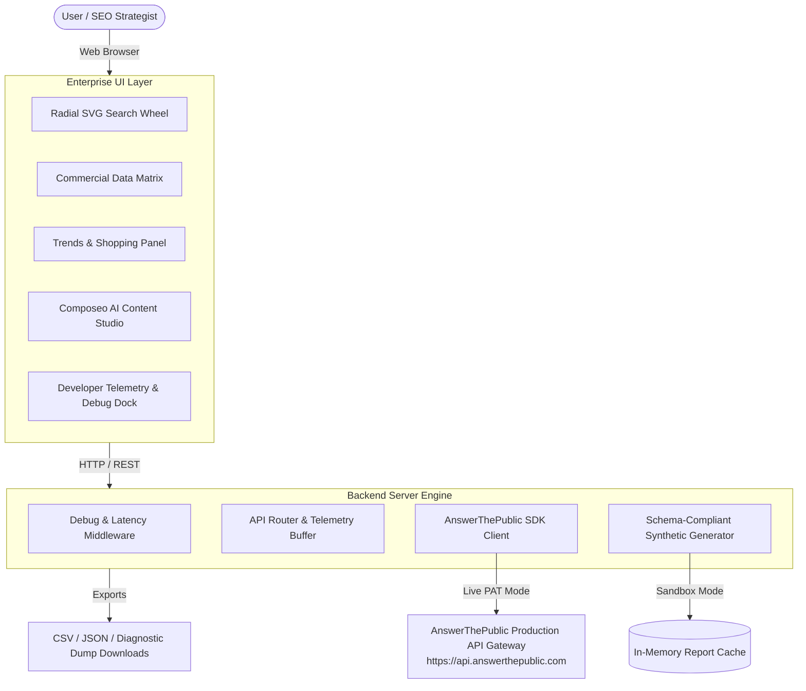

# 🚀 AnswerThePublic Enterprise Suite & Keyword Intelligence Platform

[](https://nodejs.org/)
[](https://expressjs.com/)
[](openapi.json)
[](test-master-e2e.js)
[](LICENSE)

An enterprise-grade, high-concurrency search listening and multi-provider keyword intelligence application built on top of **AnswerThePublic (ATP by NP Digital)**. 

Features an interactive **radial SVG search wheel visualizer**, real-time intent categorization, **Google Trends breakout velocity**, shopping competitive intelligence, an **AI Content Studio ("Composeo")**, and a full **Developer Telemetry & Debug Console**.

---

## 📸 Key Capabilities

- 🌐 **Omnipotent Multi-Provider Intelligence**: Aggregate real-time search queries and autocomplete suggestions across **Google Web**, **YouTube**, **Bing**, **Amazon**, **TikTok**, **Instagram**, **ChatGPT**, and **Gemini**.
- 🎡 **Dynamic Radial SVG Search Wheels**: Interactive circular branching trees categorized by question stems (*What, Where, Why, How, Who, When, Are, Can, Which*), prepositions, and comparisons with direct **1-click SVG vector export**.
- 📊 **Commercial Data Matrix & KPI Dashboard**: Sort, filter, and analyze search queries by Search Volume, Cost-Per-Click (CPC), and Intent (*Commercial, Informational, Navigational, Transactional*).
- 📈 **Google Trends & Shopping Integration**: Track breakout search queries, velocity percentages, bid floors, and merchant retail pricing.
- ⚡ **Developer Telemetry & Debug Console**: Real-time network trace inspection, request latency profiling, raw JSON payload viewer, server memory monitoring, and full diagnostic dump exports (`.json`).
- 🤖 **Composeo AI Content Studio**: Grounded 1-click SEO content generator that drafts publication-ready Markdown articles directly from high-intent question clusters.
- 🔄 **Dual Operation Architecture**:
  - **Enterprise Sandbox**: Schema-compliant simulation engine generating realistic datasets offline for stress testing and client demos.
  - **Live Production Gateway**: Connects directly to production `https://api.answerthepublic.com` with automatic `Retry-After` 429 pacing and parent-search polling.

---

## 🏛️ System Architecture



---

## ⚡ Quick Start

### Prerequisites
- [Node.js 18+](https://nodejs.org/)
- Windows, macOS, or Linux

### Installation & Run

1. **Clone the Repository:**
   ```bash
   git clone https://github.com/abhijeetyadav-Fab-Dev/AnswerThePublic.git
   cd AnswerThePublic
   ```

2. **Install Dependencies:**
   ```bash
   npm install
   ```

3. **Start the Application:**
   ```bash
   npm start
   ```
   *(Or on Windows, simply double-click `start.bat`)*

4. Open **`http://localhost:3500`** in your browser.

---

## 🛠️ API Endpoints Reference

### Enterprise Application Endpoints (`http://localhost:3500`)

| Method | Route | Description |
| :--- | :--- | :--- |
| `GET` | `/api/health` | System health, operational mode & uptime |
| `GET` | `/api/config` | Gateway configuration, providers list & token status |
| `POST` | `/api/config` | Update personal access token or toggle mode |
| `GET` | `/api/me` | Workspace identity, scopes, and quota remaining |
| `POST` | `/api/search` | Execute keyword search across selected providers |
| `GET` | `/api/reports/:id` | Retrieve full structured search report |
| `GET` | `/api/searches` | Fetch recent search history |
| `POST` | `/api/ai/ask` | Grounded strategy brief based on report queries |
| `POST` | `/api/ai/draft-article` | Draft publication-ready Markdown SEO article |
| `GET` | `/api/export/csv/:id` | Stream structured CSV dataset |
| `GET` | `/api/export/json/:id` | Stream complete JSON report |
| `GET` | `/api/debug/state` | Telemetry state, server memory, and Node.js environment |
| `POST` | `/api/debug/toggle` | Toggle verbose telemetry logging |
| `GET` | `/api/debug/logs` | Fetch captured network traces and system logs |
| `POST` | `/api/debug/clear` | Clear debug log buffer |
| `GET` | `/api/debug/dump` | Download comprehensive diagnostic dump (`.json`) |

### Official Production OpenAPI Specifications
- **YAML Spec**: [`openapi.yaml`](openapi.yaml)
- **JSON Spec**: [`openapi.json`](openapi.json)
- **Complete Endpoints Catalog**: [`ENDPOINTS.md`](ENDPOINTS.md) *(Covers all 8 public and 143+ internal routes)*

---

## 🧪 Pre-Production Automated Verification

Run the master automated verification suite covering all 13 core subsystems:

```bash
npm test
```

### Verification Output:
```text
================================================================
  ANSWERTHEPUBLIC ENTERPRISE SUITE - MASTER E2E VERIFICATION   
================================================================

Step 1: GET /api/health ... PASSED (status: online, mode: sandbox, debug: true)
Step 2: GET /favicon.ico and /favicon.webp ... PASSED (favicon size: 51234 bytes)
Step 3: GET /api/config ... PASSED (8 providers registered)
Step 4: GET /api/debug/state ... PASSED (node: v24.19.0, pid: 12876, mem: 63MB)
Step 5: POST /api/search with 8 providers ... PASSED (providers returned: 8)
Step 6: GET /api/reports/:id ... PASSED (verified 'how' question branch)
Step 7: GET /api/debug/logs ... PASSED (telemetry logs captured in buffer)
Step 8: POST /api/ai/ask ... PASSED (generated strategy brief)
Step 9: POST /api/ai/draft-article ... PASSED (generated full article)
Step 10: GET /api/export/csv/:id ... PASSED (CSV validated: 865 lines)
Step 11: GET /api/export/json/:id ... PASSED (JSON validated with report_id)
Step 12: GET /api/debug/dump ... PASSED (diagnostic dump verified)
Step 13: Verify Frontend UI & Debug Elements ... PASSED

================================================================
  ALL 13/13 END-TO-END VERIFICATION CHECKS PASSED! 
================================================================
```

---

## 📄 License

MIT © [Abhijeet Yadav](https://github.com/abhijeetyadav-Fab-Dev)
